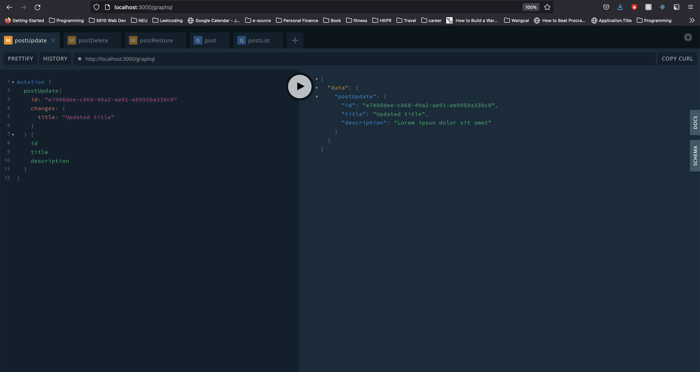

# FloraFauna
----
Link to deployment: https://florafauna-ui.herokuapp.com/posts

Students:  
Jiatian Wang wang.jiati@northeastern.edu  
Zhiqi Lin lin.zhiq@northeastern.edu  
Zhining Fang fang.zhi@northeastern.edu
* user fang.zhi and fzhining are both Zhining Fang
* Zhining is in charge of merging, maintaining deploy repos, and deploying to Heroku.

Instructions to run application locally on machine:  
1. Clone Repository
2. In API Directory and UI Directory, run npm install to install dependencies.
3. To run application, run npm start in API directory. In a new terminal and in the UI directory, 
   run npm run watch-server-hmr. In another terminal, run npm start.
Application should run in http://ui.promernstack.com:8000 on the web
4. For AWS CLI and S3: First you need the AWS Secret Key ID and Access Key ID -- ask group if don't
   have it, since each AWS account can only have up to 2 sets; Then in the api directory run npm ci.
   If on Windows go to https://docs.aws.amazon.com/cli/latest/userguide/install-cliv2-windows.html
   and download the MSI and run it to download the aws-cli. Then in the terminal run "aws configure"
   and give the appropriate access key id and secret key id. Region is us-west-2; default output
   format is "json".
   
---

### Project Iteration 2

TL;DR:

#### API Functionality: Responsible Member: Zhiqi Lin
* Connected the app to S3 for image storage.
    * Set up bucket and accounts for all team members and heroku to get credentials on S3.
    * Changed schema to further insulate the front end from the implementation of image storage in the back end. The front end only needs to send base64 encoded strings of the images to the back end and receive pre-signed urls of the images(each url will be valid for 1 hour). The backend is responsible for connecting to the third party service to store the images and retrieve links for display.
    * For image uploading, the back end receives the images from the front end as base64 Strings, sends the images to S3 bucket with a unique key, and stores the key in MongoDB.
    * For image retrieval, the back end sends the unique keys to S3 to get the corresponding pre-signed image urls, and sends the list of urls to the front end to display. The urls are pre-signed and expires after 1 hour for better security.
* Implemented post filtering according to the date and time of the sighting.
    * Unified the way date and time are stored in the database: the timestamps of sighting and post-creation are both in UTC. The post object has one more property `timezone` that records the local time of where the post was made. This allows for easier time filtering in the back end and displaying time in the front end in a way that makes more sense. All post displays in the frontend will have the local time of the user who created the post, instead of the local time of the user viewing the post.
    * Note: We used Luxon to handle time. Luxon allows timezone formats in both IANA names ("America/Los_Angeles") and UTC offsets ("UTC-8"). While IANA names allow for better user experience and deals with DST, unfortunately some Luxon functions for IANA names do not work correctly with the node.js version v10.24.1 used by the book project (they do work for v16.6.2). Therefore, we chose to use the UTC offset version to document the timezone of the post.

#### UI Functionality:

---
### Project Iteration 1

TL;DR: The project starter code comes from the Pro MERN Stack book project. Backend API has the DB, GraphQL Schema and most CRUD operations set up. Front End has all 
proposed UI components made (Map + Filter, Sighting Post Modal, User Profile, Post Add Modal. Post 
Edit), but CRUD operations are currently non-functional. CRUD operations are set up but need to be 
tested with backend as significant changes have been made to the API. Profile should be able to Get 
Posts from the API for now. For iteration 2, all CRUD operations will be fully functional and Map 
markers will display actual posts from the database. Other plans include implementing features for 
displaying images, user specific profiles, and post commenting.

#### API Functionality: Responsible Member: Zhiqi Lin
* Defined GraphQL Schema for Posts, Users, Comments, and Location. Modified schema for Queries and Mutations related to Post filtering and CRUD operations. For the next iteration, user information will be created or updated in a “users” collection and persisted.
* Established Atlas MongoDB for project and defined methods for post CRUD operations.
    * Refactored issue code to posts and post related attributes.
* Set up Amazon S3 bucket to store images of the posts. 
    * For image uploading, at the moment, the API receive the images from UI as base64 Strings, and store the imageKeys into MongoDB. For the next iteration, API will store the images in S3 bucket 
    * For image retrieval, in the next iteration, the API will send the image keys to S3 to get the corresponding image urls, and send the list of urls to UI to display

#### UI Functionality:
* Refactored Page code from issue tracker to accommodate map and new filter panel. 
  
    * Responsible Members: Jiatian Wang and Zhining Fang
    * Styled map from Google Maps API, populated with placeholder markers for Iteration 1. User can 
      search for a location to display on the map -- currently cannot search for markers.
      * Iteration 2 will have appropriate post markers read from MongoDB
    * Filter panel has collapsible filter options
      
      * Filter is not currently functional, will be once the map is connected to backend API.
        * Query to get posts is written and tested on graphQL playground but untested in front end.
      * Additional goal for Iteration 2 is to add additional filters for posts that have images vs 
        no images.
    * Date/Time filter implements a third party calendar component
        * link: https://github.com/arqex/react-datetime
    * Time Filter needs to be refactored to a range of times in the next iteration. 
* Additional New Components (Responsible Member: Zhining Fang) : 
    * Add a post(Modal) - Modal that currently pops up on clicking the + button on the navigation bar.
      
      * Next iteration will refactor such that user can select a location on the map first, then
        be prompted to create a new post in the modal.
    * Edit a post (refactored from IssueEdit) - User can access this page by going to their profile where a list of posts 
      displays as a table. After clicking the edit button, a new tab will be opened to the edit page
      of the selected post. Post update query is also in place but untested. Will be fully 
      functional for Iteration 2.
      
    * View user profile (display list of user posts, Modal) - if logged in, user can view profile by
      clicking their name and clicking the view profile button.
      
      * Currently, the profile displays user Name and Email and all available posts (including ones 
        the user did not make). Iteration 2 will display only posts that belong to the currently 
        logged-in user. Code with query and calls to the backend are already set up, is just 
        currently untested.
    * View a post (Modal) - Currently user can view a post by clicking on the view post button in their 
      profile table. Post will display its attributes including title, location, images if 
      available, the date and time of the sighting, the name of the user who posted and a 
      description if available. There is a disabled button for comments as a placeholder for sending 
      comments to the post.
      
      * Images do not currently work. Backend has set up a process for images involving MongoDB and 
        AWS S3 for image hosting. Will be completed in Iteration 2.
      * Comments do not display currently. Iteration 2 will display comments appropriately and users
        will be able to actually send comments.
      * Stretch goal: Display longitude/latitude as real locations instead of coordinates.
    
